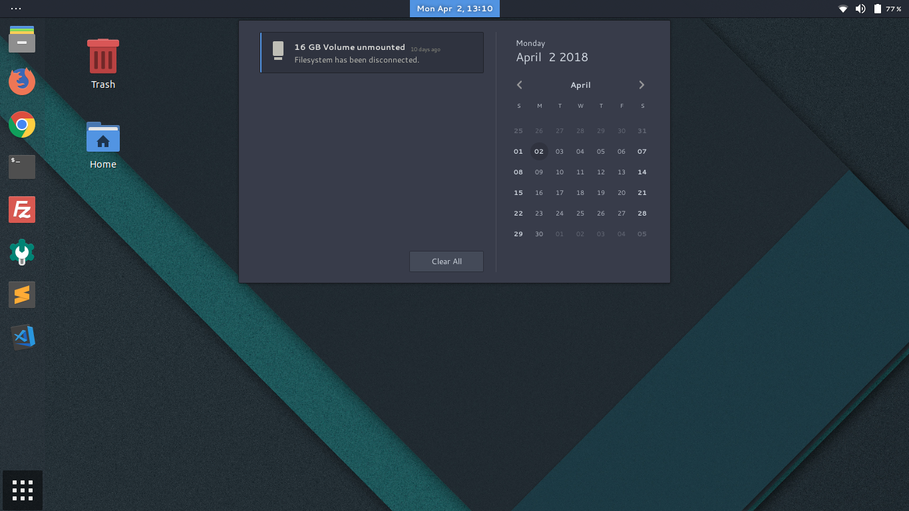

# Awesome Ubuntu 😎



PS: Tested with Ubuntu 17 (Gnome)

## Theming

* Install gnome tweak (avaliable on Ubuntu Software)
* Install Arc Theme at `https://github.com/horst3180/arc-theme`
* Install GTK 3
   ```
   $ sudo apt-get install libgtk-3-dev
   ```
* Install Filezilla theme at `https://github.com/PapirusDevelopmentTeam/papirus-filezilla-themes`
   
## Misc

* Install Google Fonts
   ```
   cd && wget https://raw.githubusercontent.com/hotice/webupd8/master/install-google-fonts
   chmod +x install-google-fonts
   ./install-google-fonts
   ```
* Install aptitude (apt with superpowers)
   ```
   $  apt-get install aptitude
   ```
* Install ssh pass (ssh without password)
   ```
   $  apt-get install sshpass
   ```
* Tree
   ```
   sudo apt-get install tree
   ```
* VSCODE as default text editor
   ```
   $ xdg-mime default code.desktop text/plain
   ```

## Open VPN
```
sudo apt-get install openvpn network-manager-openvpn-gnome
```

